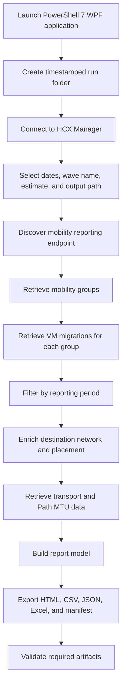

# HCX 9.1 Mobility Analytics and Executive Reporting Toolkit Wiki

This wiki is the detailed operator and maintainer guide for `HCX91_Mobility_Analytics_Executive_Report_Rev_1.0.ps1`. It describes the application workflow, reporting model, calculations, transport analytics, Path MTU mapping, evidence structure, troubleshooting approach, and release controls.

## Contents

- [Purpose and Scope](#purpose-and-scope)
- [Solution Architecture](#solution-architecture)
- [Application Workflow](#application-workflow)
- [Reporting Scope](#reporting-scope)
- [Wave Completion](#wave-completion)
- [Executive Metrics](#executive-metrics)
- [Migration Status Classification](#migration-status-classification)
- [Individual VM Timing](#individual-vm-timing)
- [Compute Transfer Score](#compute-transfer-score)
- [Transport Analytics](#transport-analytics)
- [Path MTU](#path-mtu)
- [Network Mapping and Placement](#network-mapping-and-placement)
- [Charts](#charts)
- [Scrollable Tables](#scrollable-tables)
- [Exports and Artifacts](#exports-and-artifacts)
- [Logging and Sanitization](#logging-and-sanitization)
- [Operator Runbook](#operator-runbook)
- [Troubleshooting](#troubleshooting)
- [Security and Change Control](#security-and-change-control)
- [Maintainer Notes](#maintainer-notes)
- [Release Notes](#release-notes)

## Purpose and Scope

The toolkit provides executive and operational reporting for HCX 9.1 mobility activity in a VMware Cloud Foundation 9 environment.

The application is designed to:

- Authenticate to an HCX Manager.
- Retrieve mobility-group summaries.
- Retrieve VM migration records associated with each group.
- Filter results by date.
- Correlate group, VM, network, placement, transport, and error information.
- Present a wave-level executive report.
- Preserve evidence for troubleshooting and audit review.

The application does not:

- Build HCX migration payloads.
- Create mobility groups.
- Start migrations.
- Cancel migrations.
- Change HCX infrastructure.
- Modify service meshes.
- Change Path MTU.

## Solution Architecture

### Components

#### Windows automation host

Runs PowerShell 7, WPF, and the reporting application.

#### HCX Manager

Provides:

- Session authentication
- Mobility-group summaries
- VM migration records
- Mobility intent information
- Destination network mappings
- Placement information
- Service-mesh transport health
- Path MTU data

#### Output repository

A timestamped local run folder stores reports, exports, logs, raw normalized data, and sanitized diagnostics.

### Logical workflow



## Application Workflow

### Startup

At launch, the application:

1. Verifies PowerShell 7.
2. Verifies STA apartment state.
3. Relaunches in PowerShell 7 STA mode when required.
4. Verifies Windows.
5. Loads WPF assemblies.
6. Creates the initial run directory.
7. Starts application logging.
8. Attempts to start a PowerShell transcript.

### Connection

The operator enters:

- HCX Manager
- Username
- Password

The script posts to the HCX session endpoint and retrieves the `x-hm-authorization` response header. The token remains in memory and is added to subsequent REST requests.

### Collection

The collection workflow:

1. Uses the configured vCenter GUID.
2. Queries the HCX 9.1 mobility-group endpoint.
3. Converts each response into a mobility-group summary.
4. Queries VM-level migrations for each group.
5. Normalizes each VM record.
6. applies the selected date range.
7. Enriches VM records with mobility intent data.
8. Retrieves Transport Analytics and Path MTU data.
9. Builds reports and exports.

## Reporting Scope

### Start and end dates

The selected start date begins at the start of the selected day. The end date includes the full selected day through `23:59:59`.

A VM record is included when the effective migration timestamp falls within the selected reporting range.

### Wave Name

The Wave Name appears in:

- Browser title
- Report heading
- Wave completion section
- Executive summary
- Summary CSV
- WPF completion status

Example:

```text
Wave 0 - HCX 9.1 Mobility Executive Summary
```

### Estimated Wave VMs

The operator-entered estimate must be a whole number greater than zero.

The estimate is a planning value. The script does not derive the estimate from HCX.

## Wave Completion

Wave completion uses unique successfully migrated VM names:

```text
Wave Completion Percentage =
Unique Successfully Migrated VM Names / Estimated Wave VMs x 100
```

### Why unique VM names are used

A VM can have more than one historical successful record. Counting unique names prevents a repeated migration from increasing wave completion more than once.

### Values displayed

- Unique VMs Completed
- Estimated Wave VMs
- Estimated Remaining
- Completion percentage

When completed unique VMs exceed the estimate, the displayed percentage can exceed 100 percent, while the circular graphic remains visually capped at 100 percent.

## Executive Metrics

### Mobility Groups

Count of mobility-group summaries included in the selected reporting period.

### Total Scheduled VMs

Sum of `TotalVMs` across the included mobility-group summaries.

### Successfully Migrated VMs

Count of successful VM migration records in the selected reporting period.

This differs from the unique-VM wave completion count.

### Error VMs

Sum of group-level VM error counts represented by the selected mobility-group summaries.

### Cancelled VMs

Sum of group-level cancelled VM counts represented by the selected mobility-group summaries.

### Migrated vCPU

Sum of vCPU across all successful VM migration records:

```text
Migrated vCPU = Sum of vCPU for successful migration records
```

### Migrated Memory

Sum of memory bytes across all successful VM migration records, displayed in TB:

```text
Migrated Memory TB = Sum of successful VM MemoryBytes / 1 TB
```

### Migrated Disk

Sum of provisioned storage bytes across all successful VM migration records, displayed in TB:

```text
Migrated Disk TB = Sum of successful VM StorageBytes / 1 TB
```

### Average VM Migration Time

Average `DurationMinutes` across successful VM migration records.

### Maximum VM Migration Time

Largest `DurationMinutes` value among successful VM migration records.

## Migration Status Classification

A record is treated as migrated when the status matches successful terms such as:

- Complete
- Completed
- Migrated
- Success
- Succeeded
- Done

A record is treated as an error record when:

- The status matches error, failure, cancelled, or canceled terms, or
- A nonempty error message is present

### Later migrated correlation

For an error record, the application checks whether the same VM has a later successful migration record. When found, the error table marks `LaterMigrated` as true.

## Individual VM Timing

### Timestamp selection

The normalizer first reads VM progress timestamps. When unavailable, the normalizer uses other VM-level timestamp names. Group timestamps are fallback values.

### Duration

When a usable start and end time exist:

```text
DurationMinutes = EndTime - StartTime
```

When timestamps are unavailable, the script checks duration or elapsed-time fields.

### Executive timing rule

The executive average and maximum use only successful VM records. Group elapsed time remains visible in the Mobility Group Summary but is not used for the executive VM timing metrics.

## Compute Transfer Score

The score is calculated per successful VM record:

```text
Compute Transfer Score = vCPU x max(Migration Minutes, 1)
```

### Example

```text
VM configuration: 8 vCPU
Migration duration: 45 minutes
Compute Transfer Score: 360
```

### Interpretation

The score supports relative comparison. A higher score indicates a migration combining more assigned vCPU, longer duration, or both.

The score is not:

- CPU utilization
- CPU consumption
- Network throughput
- Storage throughput
- HCX health
- A migration efficiency grade
- A pass/fail determination

## Transport Analytics

The application calls the HCX service-mesh health resource and retrieves measured transport data.

### Fields

- Uplink Name
- Remote Uplink Name
- Available Upload Mbps
- Available Download Mbps
- Latency milliseconds
- Loss percentage
- Service Health

### Report layout

Transport Analytics uses a compact dashboard:

- Centered transport metrics
- Upload and download bandwidth
- Latency
- Packet loss
- Current Path MTU
- Service Health list on the right

On narrow displays, the layout changes to one column.

### Service states

The service list can include HCX migration services returned by the endpoint, such as:

- RAV
- OSAM
- BULK
- VMOTION

The report presents the values returned by HCX.

## Path MTU

### Endpoint

```text
/hybridity/api/interconnect/underlay/pmtu/serviceMesh/{serviceMeshId}?vcGuid={vcGuid}
```

### Correlation

The application correlates a transport row with a Path MTU item by:

1. Matching the local uplink name.
2. Matching the remote uplink name if the local name does not match.
3. Leaving MTU fields empty when no reliable match exists.

### Field mapping

```text
discoveredMtu          -> Discovered MTU
currentMtu             -> Current MTU
configuredMtu          -> Configured MTU
pmtuMetrics[].rxPmtu   -> Receive Path MTU
pmtuMetrics[].txPmtu   -> Transmit Path MTU
```

### Failure behavior

Path MTU collection is optional. If the Path MTU request fails, Transport Analytics can still display bandwidth, latency, packet loss, and service health.

## Network Mapping and Placement

### Mobility intent lookup

The application uses the mobility intent response to collect:

- Destination network name
- Destination network ID
- Destination network type
- Source network name
- Destination placement

### Mapping format

When source and destination names are both available:

```text
SourceNetwork to DestinationNetwork
```

The application does not display empty arrows or bracket placeholders.

### Successful VM fallback

When a successful VM record has no destination network, the report checks another collected record using:

1. The same VM entity ID
2. The same VM name

The most recent matching record with a populated network can supply the display value.

### Conditional section

If no valid network rows exist, the VM Network Mappings and Placement section is omitted.

## Charts

### Daily Migrated VM Count

Groups successful VM records by completion date.

### Top Five VMs by Migration Time

Sorts successful VM records by `DurationMinutes` descending and displays the first five.

### Top Five VMs by Storage Transferred

Sorts successful VM records by `StorageBytes` descending and displays the first five.

### Top Five VMs by Compute Transfer Score

Sorts successful VM records by `ComputeScore` descending and displays the first five.

### Sizing

Chart cards are prepared for five rows and use vertical overflow protection. Horizontal scrolling is disabled for chart cards.

## Scrollable Tables

Every table returned by the shared HTML table function is enclosed in `tablewrap`.

The release uses:

```css
.tablewrap {
    height: 300px;
    max-height: 300px;
    overflow-x: auto;
    overflow-y: scroll;
    max-width: 100%;
    scrollbar-gutter: stable both-edges;
    overscroll-behavior: contain;
}
```

### Operator controls

When the pointer is over a table:

- Mouse wheel scrolls vertically
- Vertical scrollbar can be dragged
- Horizontal scrollbar reveals additional columns
- Page Up and Page Down can be used when the table has focus

### Sticky headers

Column headings remain visible:

```css
th {
    position: sticky;
    top: 0;
    z-index: 2;
}
```

## Exports and Artifacts

### Run folder

```text
HCX91-Mobility-Analytics-Run-YYYYMMDD-HHMMSS
```

### Logs

- Main application log
- PowerShell transcript

### Debug-Artifacts

Sanitized REST requests, responses, failures, endpoint evidence, and exceptions.

### Raw-API

Normalized source collection and supporting raw response data.

### Reports

- Executive HTML report
- Artifact manifest

### Exports

- Raw CSV
- Summary CSV
- Daily CSV
- Daily Guest OS CSV where retained
- Mobility Group Summary CSV
- Excel workbook when available

### Artifact validation

Before success is reported, the application verifies that required output files:

- Exist
- Are files
- Have a nonzero length

The manifest includes:

- File name
- Full path
- Length
- SHA-256 hash
- Last write time

## Logging and Sanitization

### Log levels

- `PASS`
- `INFO`
- `WARN`
- `ERROR`
- `DEBUG`

### Sanitized values

Diagnostic sanitization targets:

- Passwords
- Tokens
- Access tokens
- Refresh tokens
- Authorization headers
- `x-hm-authorization`
- Cookies
- CSRF and XSRF values
- Active password text

### Debug mode

Debug logging is enabled by default and can be controlled through the WPF interface.

## Operator Runbook

### Step 1: Launch

```powershell
Set-Location C:\Script
& '.\HCX91_Mobility_Analytics_Executive_Report_Rev_1.0.ps1'
```

### Step 2: Connect

Enter the HCX Manager, username, and password, then select **Connect**.

### Step 3: Select dates

Choose the reporting start and end dates.

### Step 4: Select output location

Use **Select Folder** when the report should be written somewhere other than the launch directory.

### Step 5: Enter wave information

Example:

```text
Wave Name: Wave 0
Estimated Wave VMs: 100
```

### Step 6: Generate reports

Select **Collect and Generate Reports**.

### Step 7: Review status

Confirm that the status displays wave progress and error-record count.

### Step 8: Open output

Select **Open HTML** and **Open Run Folder**.

### Step 9: Archive evidence

Retain the report, manifest, logs, and required supporting exports according to the change or audit process.

## Troubleshooting

### Parser error

Use the exact released script. Validate the complete file after any edit:

```powershell
$tokens = $null
$errors = $null

[System.Management.Automation.Language.Parser]::ParseFile(
    '.\HCX91_Mobility_Analytics_Executive_Report_Rev_1.0.ps1',
    [ref]$tokens,
    [ref]$errors
) | Out-Null

$errors
```

Any modification can invalidate a digital signature and should be followed by approved re-signing.

### Authentication failure

Review:

- HCX address
- TCP 443 connectivity
- Username and password
- Main log
- Sanitized session request and response artifacts

### Empty report

Confirm:

- Date range
- HCX mobility-group data exists in the range
- Configured vCenter GUID is correct
- Account permissions
- Endpoint discovery result

### Transport Analytics unavailable

Review the `serviceMeshHealth` REST artifact. Confirm `uplinkMetrics`, `measuredData`, and `maxAvailableBandwidth` are present.

### MTU unavailable

Review the Path MTU REST request. Confirm:

- Service mesh ID is populated
- HTTP response is successful
- Uplink names correlate
- MTU fields exist

### Destination network unavailable

Review the mobility intent response for:

- `networkParams`
- `networkMappings`
- `srcNetworkName`
- `destNetworkName`
- `destNetworkId`
- `destNetworkType`

### Large tables

Use the vertical scrollbar inside each table. Use the horizontal scrollbar for additional columns. The primary page and each table scroll independently.

### Excel export failure

Review the main log. CSV and HTML outputs remain the primary fallback when the optional Excel module is unavailable.

## Security and Change Control

- Run from an approved Windows administrative workstation.
- Restrict access to the script and output directory.
- Never publish production endpoints, VM names, logs, reports, or raw API captures without sanitization.
- Retain the previous script release for rollback.
- Test revisions in a nonproduction HCX 9.1 environment.
- Run a full PowerShell parser check before release.
- Use PSScriptAnalyzer according to organizational standards.
- Sign the final script through the approved code-signing process.
- Attach a checksum to the release.

## Maintainer Notes

### Versioning

Keep these values aligned:

- Released filename
- `.SYNOPSIS` revision
- `$script:AppVersion`
- Report footer version
- Git tag
- GitHub release title
- README release
- Wiki release notes

For the final 1.0 release, set:

```powershell
$script:AppVersion = '1.0'
```

### Parser validation

Run before every commit that changes PowerShell:

```powershell
$tokens = $null
$errors = $null
[System.Management.Automation.Language.Parser]::ParseFile(
    $Path,
    [ref]$tokens,
    [ref]$errors
) | Out-Null

if ($errors.Count -gt 0) {
    $errors | Format-List
    throw 'PowerShell parser validation failed.'
}
```

### Suggested CI checks

- PowerShell parser validation
- PSScriptAnalyzer
- Secret scanning
- File-name and embedded-version consistency
- Required-function presence
- Required report-label presence
- No production test data in examples

### Release artifacts

Recommended release attachments:

- Final `.ps1` script
- SHA-256 checksum
- README
- Wiki source
- Sanitized example report
- Sanitized screenshots

## Release Notes

### Release 1.0

- Initial public repository release of the HCX 9.1 Mobility Analytics and Executive Reporting Toolkit.
- Added WPF connection and reporting interface.
- Added date and wave scope.
- Added wave completion visualization.
- Added mobility-group and VM-level collection.
- Added migrated resource totals.
- Added individual VM migration timing.
- Added daily and Top Five charts.
- Added Compute Transfer Score guidance.
- Added Transport Analytics and Service Health.
- Added Path MTU data.
- Added destination network and placement reporting.
- Added error and later-recovery correlation.
- Added scrollable report tables with sticky headers.
- Added HTML, CSV, JSON, Excel, and artifact manifest output.
- Added sanitized diagnostics and transcript logging.
- Added artifact existence, size, and SHA-256 validation.

